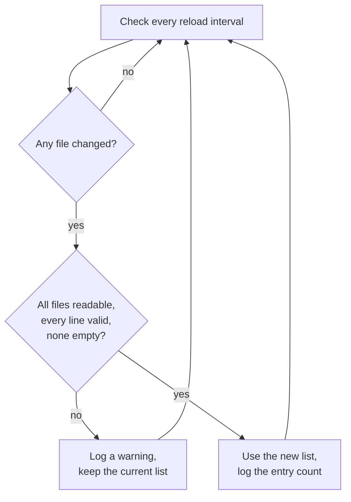

# Configuration

The [README](../README.md) covers installation, the realm options and common
setups. This page has the details.

## How a domain is decided

Every entry covers the domain and all its subdomains: `mailinator.com` also
matches `inbox.mailinator.com`. Case, a trailing dot and Unicode vs. punycode
spelling (`bücher.example` / `xn--bcher-kva.example`) don't matter.

The first rule that applies decides:

1. The **most specific** matching entry in `allowed-domains` or
   `blocked-domains`. That's how you allow `company.com` but block
   `contractors.company.com`, or the reverse. If both lists hold the same
   entry, blocked wins.
2. In **allowlist-only** mode, anything no allowed entry covers is rejected.
   This mode needs at least one allowed domain.
3. If `block-disposable` is on, domains on the disposable list are rejected.
4. Everything else is accepted.

## Server-wide domain lists

For lists that are too long for the user profile, or that you want to
maintain outside Keycloak, use plain text files: one domain per line, `#`
starts a comment. Point Keycloak at them with these server options (several
files separated by commas):

| Option                                                        | Adds its entries to             |
| ------------------------------------------------------------- | ------------------------------- |
| `--spi-validator-email-domain-policy-disposable-domains-file` | the bundled disposable list     |
| `--spi-validator-email-domain-policy-blocked-domains-file`    | every realm's `blocked-domains` |
| `--spi-validator-email-domain-policy-allowed-domains-file`    | every realm's `allowed-domains` |

As environment variables: `KC_SPI_VALIDATOR_EMAIL_DOMAIN_POLICY_DISPOSABLE_DOMAINS_FILE`
and so on. On Keycloak 26.3 and later you can also use the newer
`--spi-validator--email-domain-policy--disposable-domains-file` spelling.

- The files apply to all realms that use the validator, with the same rules
  as the realm's own lists.
- They're read at startup, so restart Keycloak after changing them. The
  disposable files can also be
  [reloaded while Keycloak runs](#keeping-the-disposable-list-up-to-date).
- A missing file or a malformed line stops Keycloak from starting, rather
  than silently not blocking.

See [examples/docker-compose.yml](../examples/docker-compose.yml).

## Keeping the disposable list up to date

The bundled list only changes with a new release. To use a fresher list
without upgrading or restarting, keep your own copy in a
`disposable-domains-file` and let Keycloak check it for changes:

| Option                                                                   | Default   | What it does                                                               |
| ------------------------------------------------------------------------ | --------- | -------------------------------------------------------------------------- |
| `--spi-validator-email-domain-policy-disposable-domains-reload-interval` | `0` (off) | Every this many seconds, read the disposable files again if they changed.  |

As an environment variable: `KC_SPI_VALIDATOR_EMAIL_DOMAIN_POLICY_DISPOSABLE_DOMAINS_RELOAD_INTERVAL`.

The extension never downloads anything itself. Updating the file is up to
you, for example with a daily cron job or a sidecar container:

```sh
#!/bin/sh
# Download to a temporary file first, then rename it into place, so Keycloak
# never sees a half-written list.
set -eu
dir=/opt/keycloak/conf/email-domains
curl -fsSL -o "$dir/disposable.txt.new" \
  https://raw.githubusercontent.com/disposable-email-domains/disposable-email-domains/main/disposable_email_blocklist.conf
mv "$dir/disposable.txt.new" "$dir/disposable.txt"
```

The downloaded entries are added to the bundled list; they don't replace it.
So a domain removed upstream stays blocked until the bundled list drops it
too. Use `allowed-domains` for false positives in the meantime.

A changed file only replaces the list in use if it's usable. Otherwise
Keycloak logs a warning and keeps the list it has:



- If one of several files is broken, none of them is applied.
- A file with no entries counts as broken, because it's most likely
  truncated. To empty the list, restart Keycloak.
- A broken file is reported once. The next check applies it once it's fixed.
- Every Keycloak node checks its own copy of the files. In a cluster, give
  all nodes the same file (for example, a shared volume or a ConfigMap);
  nodes may use different versions for up to one interval.
- Only the disposable files are reloaded. Changes to the allowed and blocked
  files still need a restart.

## Error messages

| Key                              | Shown when                           |
| -------------------------------- | ------------------------------------ |
| `error-email-domain-disposable`  | the domain is on the disposable list |
| `error-email-domain-blocked`     | a blocked entry matched              |
| `error-email-domain-not-allowed` | allowlist-only mode rejected it      |

Texts for every language of Keycloak's login theme ship in the JAR and are
added to every theme, so no theme changes are needed. Themes can override any
key; messages get the email as `{1}` and its domain as `{2}`. To set one
message for all cases in a realm, use the `error-message` option instead; a
plain text there is shown as is in every language, a message key is
translated.

The translations live in
`src/main/resources/theme-resources/messages/messages_<locale>.properties`.
Keycloak looks them up by the Java locale name (`pt_BR`, `zh_CN`, `zh_TW`),
falling back to the language and then English. Corrections from native
speakers are welcome.

## The disposable list

The bundled list is
[disposable-email-domains/disposable-email-domains](https://github.com/disposable-email-domains/disposable-email-domains)
(CC0-1.0, about 9,000 curated domains). A weekly workflow refreshes it and
opens a pull request; to refresh it locally, run `just update-domain-list`.
To get updates between releases, see
[Keeping the disposable list up to date](#keeping-the-disposable-list-up-to-date).

Found a false positive? Add the domain to `allowed-domains` right away, and
report it upstream.

## FAQ

**Keycloak logs `KC-SERVICES0047 … is implementing the internal SPI validator`.**
Expected for every custom validator; it's only a notice.

**Why can users with a now-blocked email still be updated?**
On `PUT /admin/realms/{realm}/users/{id}` Keycloak re-validates the whole
profile. Without `allow-current-email`, tightening the policy would lock
admins out of editing existing users, even just to rename them. Changing to
another rejected email is still refused.

**Does it check MX records or plus-addressing?**
No. It only looks at the domain, offline.
