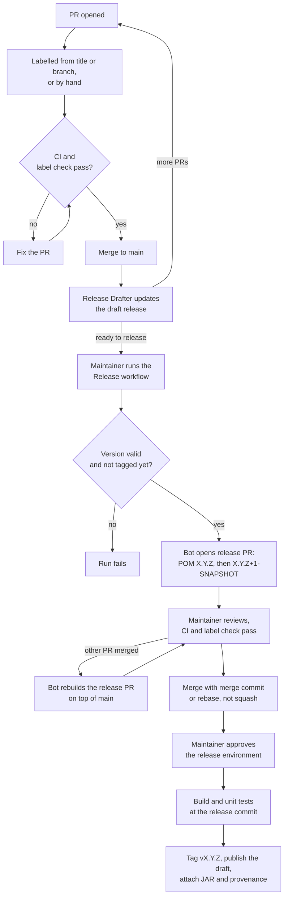

# Releasing

Releases are cut from `main`. Merged pull requests build up a draft release
with notes and a suggested version. The Release workflow proposes the version
change as a pull request; merging it tags the release commit, builds it, and
publishes the draft with the JAR.

## Versions

- The version in `pom.xml` on `main` is always a `-SNAPSHOT`. Don't change it
  by hand; the release PR does.
- The version that is actually released comes from the labels of the merged
  PRs, see below.

## Labels

Every PR needs one of these labels. It picks the section in the release notes
and how the version moves. The highest bump among the merged PRs wins.

| Label            | Title prefix / branch                    | Bump  |
| ---------------- | ---------------------------------------- | ----- |
| `breaking`       | `[Breaking]`                             | major |
| `feature`        | `[Feature]`, `feature/…`                 | minor |
| `fix`            | `[Fix]`, `[Bugfix]`, `fix/…`, `bugfix/…` | patch |
| `dependencies`   | `[Dependabot]`, `[Bot]`                  | patch |
| `documentation`  | `[Docs]`                                 | patch |
| `maintenance`    | `[Chore]`, `[Maintenance]`, `[CI]`       | patch |
| `skip-changelog` | none                                     | none  |

The title prefix is removed in the notes, so write PR titles as the line users
should read. The label is set from the title or branch when a PR is opened or
pushed to; after renaming a PR, fix the label by hand. After relabelling a
merged PR, run the Release Drafter workflow by hand to rebuild the draft.

Before 1.0.0, a `breaking` PR still bumps to 1.0.0. Use `feature` instead to
stay on 0.x.

## Cut a release

1. Open [Releases](https://github.com/InsaneDwayne/keycloak-email-domain-policy/releases)
   and edit the draft at the top. Check the notes, add upgrade notes if
   needed, and click **Save draft**, not **Publish release**.
2. Run [Actions → Release](https://github.com/InsaneDwayne/keycloak-email-domain-policy/actions/workflows/release.yml)
   on `main`. Leave **Version** empty to release the draft's version, or
   enter another one, e.g. `1.0.0-rc.1` for a pre-release; then fix the
   version in the draft's notes too.
3. Review the release PR `[Release] vX.Y.Z` linked in the run's summary. It
   should only change `<version>` in `pom.xml`, in two commits. Wait for the
   checks.
4. Merge it with **Create a merge commit** or **Rebase and merge**. **Not
   squash:** that drops the commit `Release vX.Y.Z`, and nothing gets
   released.
5. The **Publish release** run tags the commit and publishes the release with
   the JAR. If it waits for approval, click **Review deployments**.

The release contains exactly what is on `main` when the release PR is merged.
PRs merged while it is open are included: every push to `main` rebuilds the
release PR on top of it. If such a merge changes the draft's version, run the
Release workflow again; it replaces the old release PR.

Pushing a tag or publishing a release by hand does not release anything.

## If something fails

- **Release workflow fails:** nothing has changed on `main`. Fix the cause
  and run it again.
- **Checks fail on the release PR:** the problem is on `main`. Close the
  release PR, fix `main` in a normal PR, and run the Release workflow again.
- **Publish release finds no release commit** (the PR was squashed) **or
  reports changes on `main` that aren't in the release commit:** nothing was
  released. Run the Release workflow again.
- **Publish release fails before `Tag the release commit`:** no tag exists
  yet. Re-run failed jobs for a temporary failure; otherwise fix the cause in
  a PR and release the next version.
- **Publish release fails at `Publish the release`:** the tag exists, so
  don't re-run the job. Download the `jar` artifact from the run, then edit
  the draft: set the tag and title, attach the JAR, and publish it.

Never delete a pushed tag to release the same version again; release the next
version instead.
