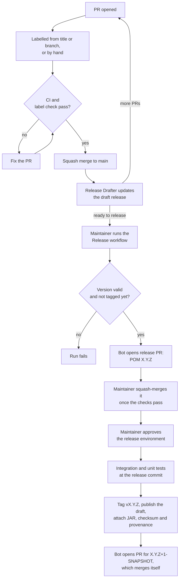

# Releasing

Releases are cut from `main`. Merged pull requests build up a draft release
with notes and a suggested version. The Release workflow opens a release PR
that sets that version; squash-merging it tags the resulting commit, builds
it, publishes the draft with the JAR, and opens a second PR that moves `main`
on to the next `-SNAPSHOT`, which merges itself.

## Versions

- The version in `pom.xml` on `main` is a `-SNAPSHOT`, except between merging
  a release PR and the next-version PR merging itself. Don't change it by
  hand; the release PRs do.
- The tagged commit has the released version in `pom.xml`, so building a
  tag gives the released JAR.
- The version that is actually released comes from the labels of the merged
  PRs, see below.

## Labels

Every PR needs one of these labels. It picks the section in the release notes
and how the version moves. The highest bump among the merged PRs wins.

| Label            | Title prefix / branch                    | Bump  |
| ---------------- | ---------------------------------------- | ----- |
| `breaking`       | `[Breaking]`                             | major |
| `feature`        | `[Feature]`, `feature/…`                 | minor |
| `fix`            | `[Fix]`, `[Bugfix]`, `fix/…`, `bugfix/…` | patch |
| `dependencies`   | `[Dependabot]`, `[Bot]`                  | patch |
| `documentation`  | `[Docs]`                                 | patch |
| `maintenance`    | `[Chore]`, `[Maintenance]`, `[CI]`       | patch |
| `skip-changelog` | none                                     | none  |

The title prefix is removed in the notes, so write PR titles as the line users
should read. The label is set from the title or branch when a PR is opened or
pushed to; after renaming a PR, fix the label by hand. After relabelling a
merged PR, run the Release Drafter workflow by hand to rebuild the draft.

Before 1.0.0, a `breaking` PR still bumps to 1.0.0. Use `feature` instead to
stay on 0.x.

## Cut a release

1. Open [Releases](https://github.com/InsaneDwayne/keycloak-email-domain-policy/releases)
   and edit the draft at the top. Check the notes, add upgrade notes if
   needed, and click **Save draft**, not **Publish release**.
2. Run [Actions → Release](https://github.com/InsaneDwayne/keycloak-email-domain-policy/actions/workflows/release.yml)
   on `main`. Leave **Version** empty to release the draft's version, or
   enter another one, e.g. `1.0.0-rc.1` for a pre-release; then fix the
   version in the draft's notes too.
3. Review the release PR `[Release] vX.Y.Z` linked in the run's summary. It
   should only change `<version>` in `pom.xml` and, for a final release, the
   JAR version in the README and `examples/`. Wait for the checks.
4. Squash-merge it, like any other PR.
5. The **Publish release** run runs the integration tests, then waits for
   approval: click **Review deployments**. If it shows a warning that the
   draft is for another version, see below. It then tags the commit and
   publishes the release with the JAR and its `.sha256`.
6. The bot opens `[Release] Prepare next development version …` and turns on
   auto-merge. If your ruleset requires an approval, approve it; if
   auto-merge is off, the run says so and you merge it by hand.

The release contains exactly what is on `main` when the release PR is merged,
including PRs merged while it was open. Every merge to `main` regenerates the
draft's notes, so redo edits to them after merging other PRs; merging the
release PR doesn't. If such a merge raises the draft's version, e.g. a
feature while a patch release is open, run the Release workflow again with
the new version; it replaces the old release PR.

Pushing a tag or publishing a release by hand does not release anything.

## If something fails

- **Release workflow fails:** nothing has changed on `main`. Fix the cause
  and run it again.
- **Checks fail on the release PR:** the problem is on `main`. Close the
  release PR, fix `main` in a normal PR, and run the Release workflow again.
- **Publish release warns that the draft is for another version:** a PR
  merged while the release PR was open changed the draft. Check that the
  notes fit the version before approving; if they don't, reject the
  deployment, fix the draft's notes, and run Publish release again with
  **Re-run all jobs**.
- **Publish release fails before `Tag the release commit`:** no tag exists
  yet. Re-run failed jobs for a temporary failure. Otherwise `main` keeps
  version X.Y.Z: fix the cause in a PR and release the next version, which
  also moves `main` on.
- **Publish release fails at `Publish the release`:** the tag exists, so
  don't re-run the job. Download the `jar` artifact from the run, then edit
  the draft: set the tag and title, attach the JAR and `.sha256`, and
  publish it. Then re-run the failed jobs to open the next-version PR.
- **The next-version PR fails or is closed:** run the failed job again, or
  open a PR that sets the version with
  `mvn versions:set -DnewVersion=X.Y.Z-SNAPSHOT -DgenerateBackupPoms=false`.

Never delete a pushed tag to release the same version again; release the next
version instead.

## Repository setup

The workflows rely on these GitHub settings:

- A GitHub App installed on the repository with read and write access to
  contents and pull requests. Its client ID is the variable `BOT_CLIENT_ID`,
  its private key the secret `BOT_PRIVATE_KEY`. It opens the release PRs, so
  CI runs on them, and pushes the release tags.
- The labels from [Labels](#labels).
- Squash merging and **Allow auto-merge** in the repository settings.
- The ruleset for `main` requires the checks `Build and unit tests`,
  `Integration tests` and `Release label`.
- A ruleset for `v*` tags that restricts creating, updating and deleting
  them, with the App on its bypass list.
- An environment `release` with you as required reviewer, **Prevent
  self-review** off, and deployments limited to `main`.
